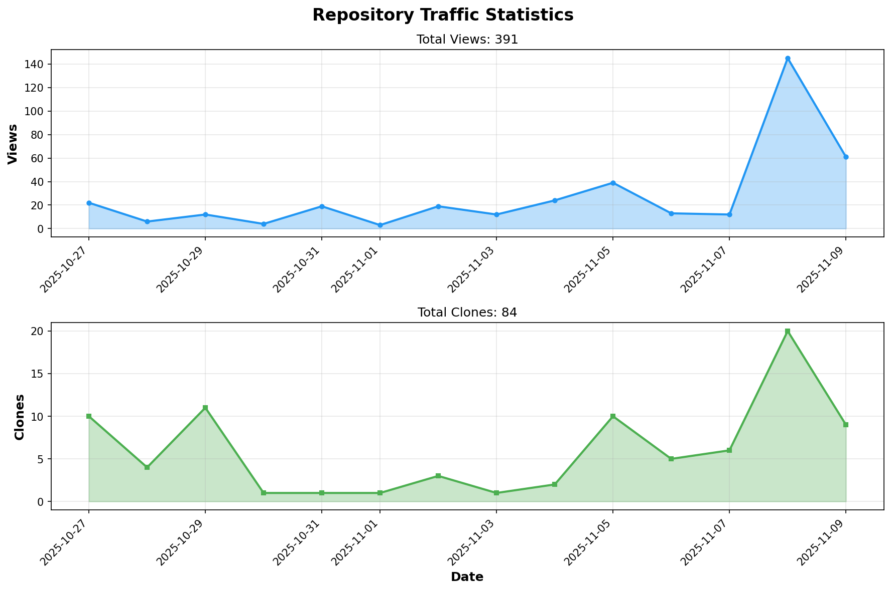

# 📖 KakeiBon（家計簿）

<div align="center">

> **A Modern Household Budget App with Focus on Readability and Usability**  
> **見やすさと使いやすさを追求した、モダンな家計簿アプリケーション**

[](https://www.rust-lang.org/)
[](https://tauri.app/)
[](#test-results--テスト結果)
[](LICENSE)

[🇯🇵 日本語詳細](README_ja.md) | [🇬🇧 English Details](README_en.md)

</div>

---

## 🚧 Development Status / 開発状況

**🔥 Actively Under Development / 鋭意開発中**

Development is progressing smoothly, and we strive to update daily!  
開発は順調に進んでおり、できるだけ日々更新するようにしています！

**Last Updated / 最終更新**: 2025-11-11 (JST)

<!-- STATS_START -->
## 📊 Repository Statistics / リポジトリ統計

<div align="center">



| Metric | Count |
|--------|-------|
| 👁️ **Total Views** / 総閲覧数 | **477** |
| 📦 **Total Clones** / 総クローン数 | **105** |

*Last Updated / 最終更新: 2025-11-11 17:07 UTC*

</div>
<!-- STATS_END -->

---

## 📚 Legacy Version / 前身プロジェクト

**Looking for the stable Lazarus/Free Pascal version? / 安定版（Lazarus/Free Pascal版）をお探しですか？**

👉 **[KakeiBon (Original)](https://github.com/BonoJovi/KakeiBon)** - すぐに使える完成版！

The original KakeiBon is a **fully functional household budget app** ready to use right now!  
元祖KakeiBonは、**今すぐ使える完成版の家計簿アプリ**です！

**Key Differences / 主な違い:**
- ✅ **Stable & Production-Ready** / **安定版・本番利用可能**
- 📦 **Pre-built Binaries Available** / **ビルド済みバイナリあり**（[Releases](https://github.com/BonoJovi/KakeiBon/releases/)）
- 🇯🇵 **Japanese Interface Only** / **日本語インターフェース専用**
- 🖥️ **Linux & Windows Support** / **Linux & Windows 対応**
- 🔤 **Large Fonts & Accessibility** / **大きな文字とアクセシビリティ**

**Why Rust Version? / なぜRust版？**

This Rust rewrite offers:
- ⚡ **Better Performance** / より高速
- 🔒 **Enhanced Security** (Argon2 + AES-256-GCM) / 強化されたセキュリティ
- 🌐 **Full Multilingual Support** / 完全多言語対応
- 🎨 **Modern Architecture** / モダンなアーキテクチャ
- 🔮 **Future Expandability** / 将来の拡張性

💡 **Try both and choose what works best for you!** / 両方試して、お好みの方をお使いください！

---

## ✨ Key Features / 主な特徴

### 🔤 Large, Easy-to-Read Text / 大きな文字で見やすい
Designed with high visibility in mind - comfortable for long-term use  
視認性を重視した設計で、長時間の使用でも目が疲れにくい

### 🎯 Intuitive User Interface / 直感的な操作性
Simple and clear UI that anyone can master quickly  
誰でもすぐに使いこなせる、シンプルで分かりやすいUI

### ♿ Accessibility Support / アクセシビリティ対応
- **Font Size Adjustment**: Small/Medium/Large/Custom (10-30px)  
  **フォントサイズ調整**: 小/中/大/カスタム（10-30px）
- **Keyboard Navigation**: Fully supported  
  **キーボードナビゲーション**: 完全対応
- **Focus Indicators**: Clear visual feedback  
  **フォーカスインジケーター**: 明確な視覚フィードバック

### 🌐 Multilingual Support / 多言語対応
Switch between Japanese and English seamlessly  
日本語・英語の切り替えが可能

### 🔒 Strong Security / 強固なセキュリティ
- Argon2id password hashing / パスワードハッシュ化
- AES-256-GCM data encryption / データ暗号化
- Role-based access control / ロールベースのアクセス制御

---

## 🚀 Current Features / 実装済み機能

| Feature / 機能 | Description / 説明 | Status / ステータス |
|----------------|-------------------|---------------------|
| 💰 **Category Management**<br/>**費目管理** | Hierarchical category system (Major/Middle/Minor)<br/>大分類・中分類・小分類の階層的管理 | ✅ Complete<br/>完成 |
| 👥 **User Management**<br/>**ユーザー管理** | Multi-user support (Admin/General)<br/>マルチユーザー対応（管理者/一般） | ✅ Complete<br/>完成 |
| 🏦 **Account Management**<br/>**口座管理** | Account master data management<br/>口座マスタ管理 | ✅ Complete<br/>完成 |
| 🏪 **Shop Management**<br/>**店舗管理** | Shop master data management<br/>店舗マスタ管理 | ✅ Complete<br/>完成 |
| 🌍 **Multilingual**<br/>**多言語対応** | Dynamic language switching (JP/EN) - 298 resources<br/>日本語・英語の動的切り替え - 298リソース | ✅ Complete<br/>完成 |
| 🔧 **Customization**<br/>**カスタマイズ** | Font size, language preferences<br/>フォントサイズ、言語設定 | ✅ Complete<br/>完成 |
| 📝 **Transaction Management**<br/>**入出金管理** | Header-level CRUD, filters, pagination<br/>ヘッダレベルCRUD、フィルター、ページネーション | ✅ Partial<br/>部分完成 |
| 📋 **Transaction Details**<br/>**入出金明細** | Item-level transaction management<br/>明細レベル管理 | 📅 Planned<br/>予定 |
| 📊 **Reports**<br/>**集計・レポート** | Monthly/annual summaries, graphs<br/>月次・年次レポート、グラフ | 📅 Planned<br/>予定 |

---

## 💻 Technology Stack / 技術スタック

```
Frontend / フロントエンド:  Vanilla JavaScript (ES6 Modules) + HTML5 + CSS3
Backend / バックエンド:     Rust + Tauri v2.8.5
Database / データベース:    SQLite (WAL mode)
Security / セキュリティ:   Argon2id + AES-256-GCM
Testing / テスト:          416 tests passing (Rust: 133, JS: 283)
i18n Resources / 翻訳:     298 resources (149 unique keys, 2 languages)
```

---

## 📦 Installation / インストール

### Prerequisites / 前提条件
- Rust 1.70+ (Install via [rustup](https://rustup.rs/) / [rustup](https://rustup.rs/)でインストール)
- Node.js 18+ (for Tauri CLI / Tauri CLI用)

### Build & Run / ビルド・実行

```bash
# Clone repository / リポジトリをクローン
git clone https://github.com/BonoJovi/KakeiBonByRust.git
cd KakeiBonByRust

# Run in development mode / 開発モードで起動
cargo tauri dev

# Production build / プロダクションビルド
cargo tauri build
```

---

## 🧪 Test Results / テスト結果

```
Backend (Rust) / バックエンド:    133 passing (3 skipped - unimplemented features)
Frontend (JavaScript) / フロント:  283 passing
Total Tests / 総テスト数:          416 passing ✅
Success Rate / 成功率:            100% (implemented features)
```

See [TEST_SUMMARY.md](docs/ja/TEST_SUMMARY.md) for details / 詳細は [TEST_SUMMARY.md](docs/ja/TEST_SUMMARY.md) を参照

---

## 📚 Documentation / ドキュメント

### For Users / ユーザー向け
- 📖 **User Guide / ユーザーガイド**
  - [English](docs/en/USER_GUIDE.md) / [日本語](docs/ja/USER_GUIDE.md)
- 🔧 **Troubleshooting / トラブルシューティング**
  - [English](docs/en/TROUBLESHOOTING.md) / [日本語](docs/ja/TROUBLESHOOTING.md)

### For Developers / 開発者向け
- 🏗️ **Developer Guide / 開発者ガイド**
  - [English](docs/en/DEVELOPER_GUIDE.md) / [日本語](docs/ja/DEVELOPER_GUIDE.md)
- 📝 **API Documentation / API ドキュメント**
  - [Category Management API](docs/en/API_CATEGORY.md) / [費目管理 API](docs/ja/API_CATEGORY_ja.md)
- 🧪 **Testing Strategy / テスト戦略**
  - [English](docs/en/TESTING.md) / [日本語](docs/ja/TESTING.md)

### Project Information / プロジェクト情報
- 👥 **Project Participants / プロジェクト参加者**
  - [English](docs/en/PROJECT_PARTICIPANTS.md) / [日本語](docs/ja/PROJECT_PARTICIPANTS.md)

---

## 🤝 Contributing / コントリビューション

Contributions are welcome! / プルリクエストを歓迎します！

1. Fork this repository / このリポジトリをフォーク
2. Create a feature branch / フィーチャーブランチを作成  
   `git checkout -b feature/AmazingFeature`
3. Commit your changes / 変更をコミット  
   `git commit -m 'Add some AmazingFeature'`
4. Push to the branch / ブランチにプッシュ  
   `git push origin feature/AmazingFeature`
5. Open a Pull Request / プルリクエストを開く

See [CONTRIBUTING.md](CONTRIBUTING.md) for details / 詳細は [CONTRIBUTING.md](CONTRIBUTING.md) を参照

---

## 📄 License / ライセンス

This project is licensed under the terms in the [LICENSE](LICENSE) file.  
このプロジェクトは [LICENSE](LICENSE) の下でライセンスされています。

---

## 🌟 Development Roadmap / 開発ロードマップ

- [x] User management / ユーザー管理機能
- [x] Category management / 費目管理機能
- [x] Multilingual support / 多言語対応
- [x] Accessibility features / アクセシビリティ機能
- [ ] Transaction management / 入出金データ管理 (**In Progress / 開発中**)
- [ ] Monthly/annual reports / 月次・年次集計
- [ ] Data export (CSV) / データエクスポート（CSV）
- [ ] Backup & restore / バックアップ・リストア

---

<div align="center">

**Made with ❤️ and Rust**

[Report Bug / バグ報告](https://github.com/BonoJovi/KakeiBonByRust/issues) · [Request Feature / 機能リクエスト](https://github.com/BonoJovi/KakeiBonByRust/issues)

</div>
