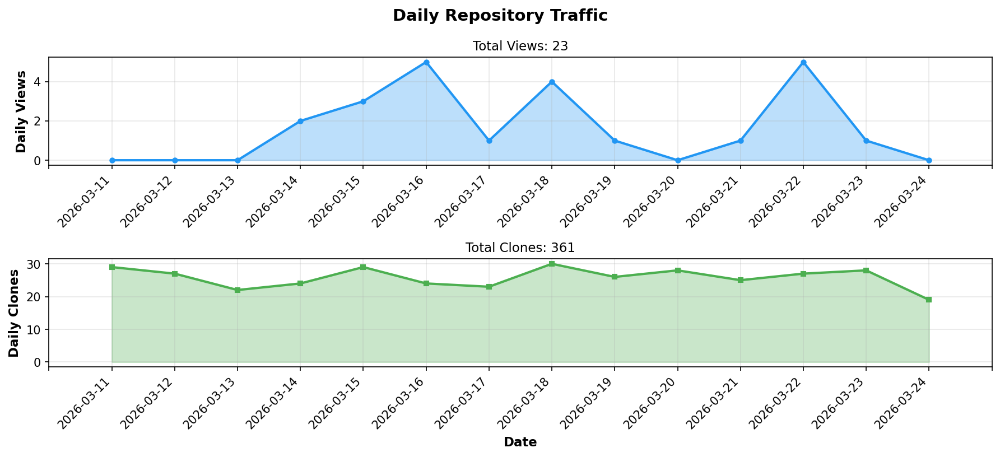
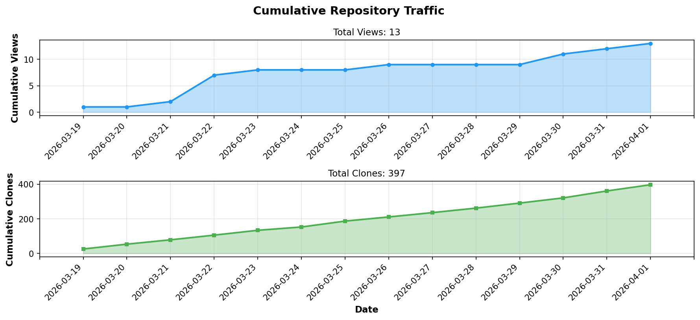

# [Book] KakeiBon（家計簿）

<div align="center">

> **A Modern Household Budget App with Focus on Readability and Usability**  
> **見やすさと使いやすさを追求した、モダンな家計簿アプリケーション**

[](https://www.rust-lang.org/)
[](https://tauri.app/)
[](#test-results--テスト結果)
[](LICENSE)

[[J][P] 日本語詳細](README_ja.md) | [[G][B] English Details](README_en.md)

</div>

---

## [Love] Message from Developer / 開発者からのメッセージ

<div style="border: 3px solid #4a90e2; padding: 20px; margin: 20px 0; background-color: #f8f9fa; font-size: 1.1em;">

### 愛すべきKakeiBonユーザの皆さんへ

いつもKakeiBonに気を留めていただき、誠にありがとうございます。
プロジェクト発案者のBonoJovi(Yoshihiro NAKAHARA)です。

**Ver.1.1.0を正式リリースいたしました！**

Ver.1.0.1からVer.1.1.0への継続的なバージョンアップでは、CI/CDパイプラインの導入により、Windows/macOS/Linux向けのマルチプラットフォーム対応とリリース自動化を実現しました。v1.0.8ではテストドキュメントの大幅な整理を行い、v1.0.9では集計機能のテスト安定性を向上させ、v1.1.0ではChart.jsを活用したダッシュボード機能を追加しました。この大規模な開発基盤の整備により、プロジェクトの開発効率が劇的に向上し、今後の継続的な機能改善とリリースがスムーズに行えるようになりました。

また、最新バージョンでは、依存ライブラリのセキュリティパッチを適用し、より安全な環境でご利用いただけるよう対策を行っております。

入出金データの入力機能が完成し、基本的な家計簿アプリケーションとしてご利用いただける状態となりました。
安定版リリースをご利用になりたい方は、[mainブランチ](https://github.com/BonoJovi/KakeiBonByRust/tree/main)をご参照ください。

現在ご覧いただいているdevブランチは開発版となり、次期バージョンの機能を開発中です。
最新の機能をいち早く試してみたい方は、こちらのdevブランチをお使いください。

**【devブランチ最新情報】** Chart.jsを活用したダッシュボード機能を追加しました！月次・年次の収支データをビジュアルに確認できるようになりました。

今後も引き続き集計・レポート機能の拡充を進めていく予定です。細々した機能も追々実装していきますので、機能拡張にご期待いただければと思います。
GitHubのissueやeメールでのメッセージも受け付けていますので、応援メッセージや将来的に実装してほしい機能など、ちょっとしたことでも良いのでご連絡いただければ幸いです。

それでは、引き続きKakeiBonをご愛顧頂ますよう、お願い申し上げます。

**2026-01-08 (JST) Written by Yoshihiro NAKAHARA**

---

### To All Beloved KakeiBon Users

Thank you for your continued interest in KakeiBon.
I'm BonoJovi (Yoshihiro NAKAHARA), the project initiator.

**We have officially released Ver.1.1.0!**

The continuous version updates from Ver.1.0.1 to Ver.1.1.0 reflect the significant impact of introducing a CI/CD pipeline, enabling multi-platform support (Windows/macOS/Linux) and automated releases. In v1.0.8, we performed major test documentation refactoring, v1.0.9 improved aggregation feature test stability, and v1.1.0 adds a Dashboard feature powered by Chart.js. This large-scale infrastructure improvement has dramatically enhanced development efficiency and enables smooth continuous feature improvements and releases going forward.

Additionally, the latest version includes security patches for dependent libraries, ensuring a safer environment for your use.

The transaction data input functionality is now complete, and KakeiBon is ready to be used as a basic household budget application.
If you would like to use the stable release version, please refer to the [main branch](https://github.com/BonoJovi/KakeiBonByRust/tree/main).

The dev branch you are currently viewing is the development version, where we are working on features for the next release.
If you want to try the latest features early, please use this dev branch.

**[Dev Branch Latest]** We've added a Dashboard feature powered by Chart.js! You can now visualize your monthly and yearly income/expense data with interactive charts.

We will continue to enhance the aggregation and reporting features. We will continue to add various features incrementally, so please look forward to continuous enhancements.
We welcome messages via GitHub issues or email, whether it's words of encouragement or suggestions for features you'd like to see in the future—any feedback is appreciated.

Thank you for your continued support of KakeiBon.

**2026-01-08 (JST) Written by Yoshihiro NAKAHARA**

</div>

---

## [Handshake] Join Our Community / コミュニティに参加

**Help make KakeiBon accessible to users worldwide!**
**KakeiBonを世界中のユーザーに届けるお手伝いをしてください！**

We welcome **all types of contributions** - not just code! Whether you're a developer, translator, or user, there's a way for you to contribute.
**あらゆる形の貢献**を歓迎します—コードだけではありません！開発者、翻訳者、ユーザーのいずれであっても、貢献する方法があります。

---

### [World] Translators Wanted! / 翻訳者募集！
**No programming experience needed! / プログラミング経験不要！**

Help make KakeiBon available in your language:
あなたの言語でKakeiBonを利用可能にするお手伝いをしてください：

- ✅ **Currently Supported / 現在サポート**: Japanese (ja), English (en)
- [Globe] **Seeking / 募集中**: Chinese (zh), Korean (ko), French (fr), German (de), Spanish (es), and more!

**How to contribute:**
- Add support for a new language / 新しい言語のサポートを追加
- Improve existing translations / 既存の翻訳を改善
- Review translation accuracy / 翻訳の正確性をレビュー

[Book] **[Translation Guide](docs/developer/en/guides/translation-guide.md)** | **[翻訳ガイド](docs/developer/ja/guides/translation-guide.md)**
🆕 **[Submit Translation Request](https://github.com/BonoJovi/KakeiBonByRust/issues/new?template=translation.yml)**

---

### [Test] Testers Wanted! / テスター募集！
**No programming experience needed! / プログラミング経験不要！**

**[Party] NEW: v1.0.7 Multi-Platform Binaries Now Available!**
**[Party] 新着: v1.0.7でマルチプラットフォームバイナリが利用可能に！**

We've just released Windows and macOS binaries through our new CI/CD pipeline, but we **urgently need real hardware testing** as the developer doesn't have access to Windows/Mac environments!

CI/CDパイプライン導入によりWindows/macOSバイナリのリリースを開始しましたが、開発者がWindows/Mac環境を持っていないため、**実機での動作確認が緊急に必要です**！

**Platform Status:**
- ✅ **Linux**: Verified and tested by developer / 開発者により検証済み・テスト済み
- ⚠️ **Windows**: **Binary available but untested on real hardware!** / **バイナリは利用可能だが実機未テスト！**
- ⚠️ **macOS (Intel & Apple Silicon)**: **Binary available but untested on real hardware!** / **バイナリは利用可能だが実機未テスト！**

**What we need from you:**
**お願いしたいこと：**
- [Search] Download and test the latest release on your Windows/Mac / Windows/Macで最新リリースをダウンロード＆テスト
- [Bug] Report any bugs or issues you encounter / 遭遇したバグや問題を報告
- ✅ Confirm if basic features work correctly / 基本機能が正常に動作するか確認
- [Comment] Share your experience (UI/UX feedback welcome!) / 使用感を共有（UI/UXフィードバック歓迎！）
- 🆕 **Review test case validity** - Check if our 800+ tests make sense! / **テストケースの妥当性をレビュー** - 800件以上のテストが妥当かチェック！

**Download:** [Latest Release](https://github.com/BonoJovi/KakeiBonByRust/releases/latest)

[Book] **[Test Overview](docs/testing/en/TEST_OVERVIEW.md)** | **[テスト概要](docs/testing/ja/TEST_OVERVIEW.md)**
[BlueBook] **[Backend Test Index](docs/testing/en/BACKEND_TEST_INDEX.md)** (201 tests) | **[バックエンドテストインデックス](docs/testing/ja/BACKEND_TEST_INDEX.md)** (201件)
[GreenBook] **[Frontend Test Index](docs/testing/en/FRONTEND_TEST_INDEX.md)** (599 tests) | **[フロントエンドテストインデックス](docs/testing/ja/FRONTEND_TEST_INDEX.md)** (599件)
🆕 **[Submit Testing Feedback](https://github.com/BonoJovi/KakeiBonByRust/issues/new?template=testing-feedback.yml)**

---

### [Idea] Feature Requests & Feedback / 機能リクエスト & フィードバック

Have ideas to make KakeiBon better?
KakeiBonをより良くするアイデアはありますか？

- 🆕 **[Submit Feature Request](https://github.com/BonoJovi/KakeiBonByRust/issues/new?template=feature_request.md)**
- [Bug] **[Report a Bug](https://github.com/BonoJovi/KakeiBonByRust/issues/new?template=bug_report.md)**
- [Comment] **[Join Discussions](https://github.com/BonoJovi/KakeiBonByRust/discussions)**

---

### [PC] Developers / 開発者

For code contributions:
コード貢献について：

- [List] **[Contributing Guide](CONTRIBUTING.md)**
- [Fix] **[Development Documentation](docs/developer/en/)**

---

**Every contribution, no matter how small, makes KakeiBon better for everyone.**
**どんなに小さな貢献でも、KakeiBonをみんなにとってより良いものにします。**

**Thank you for your support! / ご支援ありがとうございます！**

---

## [Note] Technical Articles / 技術記事

**Read more about AI-assisted development and other technical insights on Qiita!**  
**AI支援開発やその他の技術的知見についてQiitaで詳しく紹介しています！**

We share articles not only about KakeiBon development but also about AI collaboration techniques, design philosophy, and various technical topics.  
KakeiBon開発だけでなく、AI協働手法、設計思想、その他さまざまな技術トピックについて記事を公開しています。

[Point] **[Visit Qiita Profile / Qiitaプロフィールを見る](https://qiita.com/BonoJovi/)**

---

## [Bookmark] Table of Contents / 目次

- [[WIP] Development Status / 開発状況](#-development-status--開発状況)
- [[Chart] Repository Statistics / リポジトリ統計](#-repository-statistics--リポジトリ統計)
- [[Books] Legacy Version / 前身プロジェクト](#-legacy-version--前身プロジェクト)
- [✨ Key Features / 主な特徴](#-key-features--主な特徴)
- [[Rocket] Current Features / 実装済み機能](#-current-features--実装済み機能)
- [[PC] Technology Stack / 技術スタック](#-technology-stack--技術スタック)
- [[Package] Installation / インストール](#-installation--インストール)
- [[Test] Test Results / テスト結果](#-test-results--テスト結果)
- [[Books] Documentation / ドキュメント](#-documentation--ドキュメント)
- [[Handshake] Contributing / コントリビューション](#-contributing--コントリビューション)
- [[Doc] License / ライセンス](#-license--ライセンス)
- [[Star] Development Roadmap / 開発ロードマップ](#-development-roadmap--開発ロードマップ)

---

## [WIP] Development Status / 開発状況

**[Fire] Actively Under Development / 鋭意開発中**

Development is progressing smoothly, and we strive to update daily!  
開発は順調に進んでおり、できるだけ日々更新するようにしています！

**Project Started / プロジェクト開始**: 2025-10-22 (JST)
**Last Updated / 最終更新**: 2026-01-08 (JST)

> **[Robot] AI-Assisted Development / AI支援開発**  
> This project's source code and documentation are **100% generated** with the assistance of generative AI (GitHub Copilot, Claude), supervised and reviewed by the developer. This demonstrates the potential of AI-assisted development.  
> 本プロジェクトのソースコードおよびドキュメントは、生成AI（GitHub Copilot、Claude）の支援により**100%生成**され、開発者による監修とレビューを経ています。これは、AI支援開発の可能性を示す事例です。
> 
> [Chart] **[See AI Development Metrics & Quality Analysis →](docs/etc/AI_DEVELOPMENT_METRICS.md)**  
> **[AI開発の生産性と品質分析を見る →](docs/etc/AI_DEVELOPMENT_METRICS.md)**

<!-- STATS_START -->
## 📊 Repository Statistics / リポジトリ統計

<div align="center">

### 📈 Daily Traffic / 日次トラフィック



### 📊 Cumulative Traffic / 累積トラフィック



| Metric | Count |
|--------|-------|
| 👁️ **Total Views** / 総閲覧数 | **172** |
| 📦 **Total Clones** / 総クローン数 | **294** |

*Last Updated / 最終更新: 2026-01-11 01:38 UTC*

</div>
<!-- STATS_END -->

---

## [Books] Legacy Version / 前身プロジェクト

**Looking for the stable Lazarus/Free Pascal version? / 安定版（Lazarus/Free Pascal版）をお探しですか？**

[Point] **[KakeiBon (Original)](https://github.com/BonoJovi/KakeiBon)** - すぐに使える完成版！

The original KakeiBon is a **fully functional household budget app** ready to use right now!  
元祖KakeiBonは、**今すぐ使える完成版の家計簿アプリ**です！

**Key Differences / 主な違い:**
- ✅ **Stable & Production-Ready** / **安定版・本番利用可能**
- [Package] **Pre-built Binaries Available** / **ビルド済みバイナリあり**（[Releases](https://github.com/BonoJovi/KakeiBon/releases/)）
- [J][P] **Japanese Interface Only** / **日本語インターフェース専用**
- [Desktop]️ **Linux & Windows Support** / **Linux & Windows 対応**
- [Text] **Large Fonts & Accessibility** / **大きな文字とアクセシビリティ**

**Why Rust Version? / なぜRust版？**

This Rust rewrite offers:
- ⚡ **Better Performance** / より高速
- [Lock] **Enhanced Security** (Argon2 + AES-256-GCM) / 強化されたセキュリティ
- [Globe] **Full Multilingual Support** / 完全多言語対応
- [Art] **Modern Architecture** / モダンなアーキテクチャ
- [Crystal] **Future Expandability** / 将来の拡張性

[Idea] **Try both and choose what works best for you!** / 両方試して、お好みの方をお使いください！

---

## ✨ Key Features / 主な特徴

### [Art] NOT Vibe Coding / NOTバイブコーディング
Built with **proper planning and documentation first**, not vibes  
雰囲気ではなく、**きちんとした計画とドキュメント作成**を先に行う開発スタイル

### [User] Clear User-First Policy / 明確なユーザーファーストポリシーによる設計
Every feature is designed with **explicit user needs and usability** in mind  
すべての機能は**明確なユーザーニーズと使いやすさ**を念頭に置いて設計されています

### [Text] Large, Easy-to-Read Text / 大きな文字で見やすい
Designed with high visibility in mind - comfortable for long-term use  
視認性を重視した設計で、長時間の使用でも目が疲れにくい

### [Build]️ Enterprise-Grade Architecture / エンタープライズグレードのアーキテクチャ
**Session-Based Authentication** throughout all 52 API functions  
**セッションベース認証**を全52個のAPI関数で実装

- [Key] **Secure Session Management** / セキュアなセッション管理
- [Users] **User Isolation** / ユーザーデータの完全分離
- ✅ **Zero Hardcoded User IDs** / ハードコードされたユーザーID排除
- [Test] **800 Tests (100% Pass)** / 800テスト（100%合格）

### [Target] Intuitive User Interface / 直感的な操作性
Simple and clear UI that anyone can master quickly  
誰でもすぐに使いこなせる、シンプルで分かりやすいUI

### ♿ Accessibility Support / アクセシビリティ対応
- **Font Size Adjustment**: Small/Medium/Large/Custom (10-30px)  
  **フォントサイズ調整**: 小/中/大/カスタム（10-30px）
- **Keyboard Navigation**: Fully supported  
  **キーボードナビゲーション**: 完全対応
- **Focus Indicators**: Clear visual feedback  
  **フォーカスインジケーター**: 明確な視覚フィードバック

### [Globe] Multilingual Support / 多言語対応
Switch between Japanese and English seamlessly  
日本語・英語の切り替えが可能

### [Lock] Strong Security / 強固なセキュリティ
- Argon2id password hashing / パスワードハッシュ化
- AES-256-GCM data encryption / データ暗号化
- Role-based access control / ロールベースのアクセス制御

---

## [Rocket] Current Features / 実装済み機能

| Feature / 機能 | Description / 説明 | Status / ステータス |
|----------------|-------------------|---------------------|
| [Key] **Session Management**<br/>**セッション管理** | In-memory session state management<br/>メモリ内セッション状態管理 | ✅ Complete<br/>完成 |
| [Money] **Category Management**<br/>**費目管理** | Hierarchical category system (Major/Middle/Minor)<br/>大分類・中分類・小分類の階層的管理 | ✅ Complete<br/>完成 |
| [Users] **User Management**<br/>**ユーザー管理** | Multi-user support (Admin/General)<br/>マルチユーザー対応（管理者/一般） | ✅ Complete<br/>完成 |
| [Bank] **Account Management**<br/>**口座管理** | Account master data management<br/>口座マスタ管理 | ✅ Complete<br/>完成 |
| [Shop] **Shop Management**<br/>**店舗管理** | Shop master data management<br/>店舗マスタ管理 | ✅ Complete<br/>完成 |
| [Factory] **Manufacturer Management**<br/>**メーカー管理** | Manufacturer master data with IS_DISABLED feature<br/>IS_DISABLED機能付きメーカーマスタ管理 | ✅ Complete<br/>完成 |
| [Package] **Product Management**<br/>**商品管理** | Product master data with manufacturer linkage<br/>メーカー連携付き商品マスタ管理 | ✅ Complete<br/>完成 |
| [World] **Multilingual**<br/>**多言語対応** | Dynamic language switching (JP/EN) - 992 resources<br/>日本語・英語の動的切り替え - 992リソース | ✅ Complete<br/>完成 |
| [Fix] **Customization**<br/>**カスタマイズ** | Font size, language preferences<br/>フォントサイズ、言語設定 | ✅ Complete<br/>完成 |
| [Note] **Transaction Management**<br/>**入出金管理** | Header-level CRUD, filters, pagination<br/>ヘッダレベルCRUD、フィルター、ページネーション | ✅ Complete<br/>完成 |
| [Receipt] **Transaction Details**<br/>**入出金明細** | CRUD operations with smart tax calculation, automatic rounding detection<br/>スマート税計算付きCRUD操作、端数処理自動検出 | ✅ Complete<br/>完成 |
| [Chart] **Reports**<br/>**集計・レポート** | Monthly/annual summaries, graphs<br/>月次・年次レポート、グラフ | [WIP] In Progress<br/>開発中 |

---

## [PC] Technology Stack / 技術スタック

| Category / カテゴリ | Technology / 技術 | Details / 詳細 |
|---------------------|-------------------|----------------|
| **Frontend** / **フロントエンド** | Vanilla JavaScript + HTML5 + CSS3 | ES6 Modules |
| **Backend** / **バックエンド** | Rust + Tauri | v2.8.5 |
| **Database** / **データベース** | SQLite | WAL mode |
| **Security** / **セキュリティ** | Argon2id + AES-256-GCM | Password hashing + Data encryption |
| **Testing** / **テスト** | Jest + Cargo Test | 800 tests passing (Rust: 201, JS: 599) |
| **i18n Resources** / **翻訳** | JSON-based | 992 resources (496 unique keys, 2 languages) |
| **Code Lines** / **コード行数** | Total / 合計 | ~35,478 lines (Rust: 13,870, JS: 8,810, HTML: 3,355, CSS: 6,109, SQL: 3,334) |

---

## [Package] Installation / インストール

### Prerequisites / 前提条件
- Rust 1.70+ (Install via [rustup](https://rustup.rs/) / [rustup](https://rustup.rs/)でインストール)
- Node.js 18+ (for Tauri CLI / Tauri CLI用)

### Build & Run / ビルド・実行

```bash
# Clone repository / リポジトリをクローン
git clone https://github.com/BonoJovi/KakeiBonByRust.git
cd KakeiBonByRust

# Run in development mode / 開発モードで起動
cargo tauri dev

# Production build / プロダクションビルド
cargo tauri build
```

---

## [Test] Test Results / テスト結果

```
Backend (Rust) / バックエンド:    201 passing ✅
Frontend (JavaScript) / フロント:  599 passing ✅
Total Tests / 総テスト数:          800 passing ✅
Success Rate / 成功率:            100%
```

**Recent Improvements / 最近の改善**:
- ✅ **Test Coverage Expansion** / **テストカバレッジ拡大** (2025-12-07)
  - Total test count increased from 527 to 800 tests
  - Frontend tests expanded from 326 to 599 tests
  - Enhanced test coverage for aggregation features
  - Comprehensive validation of transaction processing logic

- ✅ **Security Updates** / **セキュリティアップデート** (2025-12-07)
  - Applied security patches to dependent libraries
  - Enhanced overall system security and stability

- ✅ **Session Management Integration** / **セッション管理統合** (2025-11-30)
  - All 52 API functions now use session-based authentication
  - Enhanced security with proper user isolation
  - Removed hardcoded user IDs throughout the codebase

**Test Count Methodology / テスト件数計測方法** (Updated 2025-12-07):
- **Current count (800)**: Counts only actual executable test cases (Rust: 201, JavaScript: 599)
- **Methodology / 方法**: Industry-standard test counting (test() and it() blocks only)
- **Note / 注意**: Test count increases reflect actual new test implementations, not measurement changes
  テスト件数の増加は、実際の新規テスト実装を反映しています

See [Test Overview](docs/testing/en/TEST_OVERVIEW.md) for details / 詳細は [テスト概要](docs/testing/ja/TEST_OVERVIEW.md) を参照

---

## [Books] Documentation / ドキュメント

### For Users / ユーザー向け
- [Fix] **Troubleshooting / トラブルシューティング**
  - [English](docs/user/en/TROUBLESHOOTING.md) / [日本語](docs/user/ja/TROUBLESHOOTING.md)

### For Developers / 開発者向け

#### Core Guides / コアガイド
- [Build]️ **Developer Guide / 開発者ガイド**
  - [English](docs/developer/en/guides/DEVELOPER_GUIDE.md) / [日本語](docs/developer/ja/guides/DEVELOPER_GUIDE.md)
- [Test] **Testing Documentation / テストドキュメント**
  - [Book] **[Test Overview](docs/testing/en/TEST_OVERVIEW.md)** / **[テスト概要](docs/testing/ja/TEST_OVERVIEW.md)** - Test strategy and execution guide
  - [BlueBook] **[Backend Test Index](docs/testing/en/BACKEND_TEST_INDEX.md)** / **[バックエンドテストインデックス](docs/testing/ja/BACKEND_TEST_INDEX.md)** - Complete Rust test list (201 tests)
  - [GreenBook] **[Frontend Test Index](docs/testing/en/FRONTEND_TEST_INDEX.md)** / **[フロントエンドテストインデックス](docs/testing/ja/FRONTEND_TEST_INDEX.md)** - Complete JavaScript test list (599 tests)

#### API Documentation / API ドキュメント
- [Folder] **Category Management API / 費目管理 API**
  - [English](docs/developer/en/api/API_CATEGORY.md) / [日本語](docs/developer/ja/api/API_CATEGORY.md)
- [Shop] **Shop Management API / 店舗管理 API**
  - [English](docs/developer/en/api/API_SHOP.md) / [日本語](docs/developer/ja/api/API_SHOP.md)
- [Factory] **Manufacturer Management API / メーカー管理 API**
  - [English](docs/developer/en/api/API_MANUFACTURER.md) / [日本語](docs/developer/ja/api/API_MANUFACTURER.md)
- [Package] **Product Management API / 商品管理 API**
  - [English](docs/developer/en/api/API_PRODUCT.md) / [日本語](docs/developer/ja/api/API_PRODUCT.md)
- [Money] **Transaction Management API / 入出金管理 API**
  - [English](docs/developer/en/api/API_TRANSACTION.md) / [日本語](docs/developer/ja/api/API_TRANSACTION.md)

#### UI Documentation / UI ドキュメント
- [Users] **User Management UI / ユーザー管理 UI**
  - [English](docs/developer/en/guides/USER_MANAGEMENT_UI.md) / [日本語](docs/developer/ja/guides/USER_MANAGEMENT_UI.md)
- [Bank] **Account Management UI / 口座管理 UI**
  - [English](docs/developer/en/guides/ACCOUNT_MANAGEMENT_UI.md) / [日本語](docs/developer/ja/guides/ACCOUNT_MANAGEMENT_UI.md)
- [Folder] **Category Management UI / 費目管理 UI**
  - [English](docs/developer/en/guides/CATEGORY_MANAGEMENT_UI.md) / [日本語](docs/developer/ja/guides/CATEGORY_MANAGEMENT_UI.md)
- [Factory] **Manufacturer & Product Management / メーカー・商品管理**
  - [English](docs/etc/MANUFACTURER_PRODUCT_MANAGEMENT.md) / [日本語](docs/etc/MANUFACTURER_PRODUCT_MANAGEMENT.md)
- [Money] **Transaction Management UI / 入出金管理 UI**
  - [English](docs/developer/en/guides/TRANSACTION_MANAGEMENT_UI_V2.md) / [日本語](docs/developer/ja/guides/TRANSACTION_MANAGEMENT_UI_V2.md)

#### Feature Implementation / 機能実装
- [Abacus] **Tax Calculation Logic / 税計算ロジック**
  - [Bilingual / 日英併記](docs/design/architecture/tax-calculation-logic.md)
- [Globe] **I18N Implementation / 国際化実装**
  - [English](docs/developer/en/guides/I18N_IMPLEMENTATION.md) / [日本語](docs/developer/ja/guides/I18N_IMPLEMENTATION.md)
- [World] **I18N Resources / 国際化リソース**
  - [English](docs/developer/en/guides/I18N_RESOURCES.md) / [日本語](docs/developer/ja/guides/I18N_RESOURCES.md)
- [Globe] **Dynamic Language Menu / 動的言語メニュー**
  - [English](docs/developer/en/guides/DYNAMIC_LANGUAGE_MENU.md) / [日本語](docs/developer/ja/guides/DYNAMIC_LANGUAGE_MENU.md)
- [Text] **Font Size Implementation / フォントサイズ実装**
  - [English](docs/developer/en/guides/font-size-implementation.md) / [日本語](docs/developer/ja/guides/font-size-implementation.md)
- ♿ **Accessibility Indicators / アクセシビリティインジケーター**
  - [English](docs/etc/ACCESSIBILITY_INDICATORS.md) / [日本語](docs/etc/ACCESSIBILITY_INDICATORS.md)
- [No] **IS_DISABLED Implementation / IS_DISABLED実装**
  - [English](docs/developer/en/guides/IS_DISABLED_IMPLEMENTATION_GUIDE.md) / [日本語](docs/developer/ja/guides/IS_DISABLED_IMPLEMENTATION_GUIDE.md)

#### Database & Security / データベース・セキュリティ
- [Cabinet]️ **Database Configuration / データベース設定**
  - [English](docs/developer/en/guides/DATABASE_CONFIGURATION.md) / [日本語](docs/developer/ja/guides/DATABASE_CONFIGURATION.md)
- [Refresh] **Database Migration / データベースマイグレーション**
  - [English](docs/developer/en/guides/DATABASE_MIGRATION.md) / [日本語](docs/developer/ja/guides/DATABASE_MIGRATION.md)
- [Key] **Encryption Management / 暗号化管理**
  - [English](docs/developer/en/guides/ENCRYPTION_MANAGEMENT.md) / [日本語](docs/developer/ja/guides/ENCRYPTION_MANAGEMENT.md)
- [User] **User Management / ユーザー管理**
  - [English](docs/developer/en/guides/USER_MANAGEMENT.md) / [日本語](docs/developer/ja/guides/USER_MANAGEMENT.md)
- ⚙️ **Settings Management / 設定管理**
  - [English](docs/developer/en/guides/SETTINGS_MANAGEMENT.md) / [日本語](docs/developer/ja/guides/SETTINGS_MANAGEMENT.md)

#### Design Documents / 設計ドキュメント
- [Money] **Transaction Design V2 / 入出金設計 V2**
  - [English](docs/design/architecture/TRANSACTION_DESIGN_V2.md) / [日本語](docs/design/architecture/TRANSACTION_DESIGN_V2_ja.md)

### Project Information / プロジェクト情報
- [Users] **Project Participants / プロジェクト参加者**
  - [English](docs/etc/PROJECT_PARTICIPANTS.md) / [日本語](docs/etc/PROJECT_PARTICIPANTS.md)

---

## [Handshake] Contributing / コントリビューション

Contributions are welcome! / プルリクエストを歓迎します！

1. Fork this repository / このリポジトリをフォーク
2. Create a feature branch / フィーチャーブランチを作成  
   `git checkout -b feature/AmazingFeature`
3. Commit your changes / 変更をコミット  
   `git commit -m 'Add some AmazingFeature'`
4. Push to the branch / ブランチにプッシュ  
   `git push origin feature/AmazingFeature`
5. Open a Pull Request / プルリクエストを開く

See [CONTRIBUTING.md](CONTRIBUTING.md) for details / 詳細は [CONTRIBUTING.md](CONTRIBUTING.md) を参照

---

## [Doc] License / ライセンス

This project is licensed under the terms in the [LICENSE](LICENSE) file.  
このプロジェクトは [LICENSE](LICENSE) の下でライセンスされています。

---

## [Star] Development Roadmap / 開発ロードマップ

- [x] User management / ユーザー管理機能
- [x] Category management / 費目管理機能
- [x] Multilingual support / 多言語対応
- [x] Accessibility features / アクセシビリティ機能
- [x] Transaction management / 入出金データ管理
- [x] Monthly/annual reports / 月次・年次集計
- [ ] Data export (CSV) / データエクスポート（CSV）
- [ ] Backup & restore / バックアップ・リストア

---

<div align="center">

**Made with ❤️ and Rust**

[Report Bug / バグ報告](https://github.com/BonoJovi/KakeiBonByRust/issues) · [Request Feature / 機能リクエスト](https://github.com/BonoJovi/KakeiBonByRust/issues)

</div>
