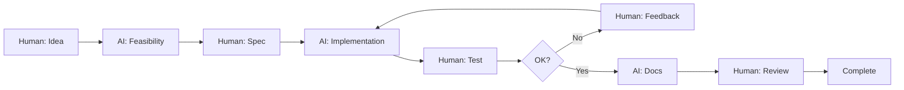

# 🤝 Project Participants

<div align="center">

**KakeiBonByRust - Human-AI Collaborative Development Project**

This project is developed through collaboration between human and AI.

</div>

---

## 👥 Participants and Roles

### 🎯 Project Owner

**Yoshihiro NAKAHARA**

- 📋 Project Founder
- 🏗️ Project Design / Planning
- 🎨 System Architecture
- 🧪 Testing (Primary)
- 📝 Documentation Review & Adjustment
- 📧 Contact: bonojovi@zundou.org

### 🤖 AI Development Partner

**AI Assistant (GitHub Copilot)**

- 💻 Coding (100% Pure AI)
- 🧪 Testing (Secondary / Technical Support)
- 📚 Documentation (Primary)
- 💡 Technical Advisor / Support

---

## 🔄 Development Structure

### Human-AI Role Division

This project adopts a new development style that combines human **creativity and judgment** with AI's **implementation power and efficiency**.

#### 🧑 Human (Yoshihiro) Role

```
┌─────────────────────────────────┐
│ Creation, Judgment, Direction    │
├─────────────────────────────────┤
│ ✓ Idea generation               │
│ ✓ Feature requirements          │
│ ✓ UI/UX direction               │
│ ✓ Implementation priorities     │
│ ✓ Final quality validation      │
│ ✓ User perspective evaluation   │
└─────────────────────────────────┘
```

#### 🤖 AI (Assistant) Role

```
┌─────────────────────────────────┐
│ Implementation, Documentation    │
├─────────────────────────────────┤
│ ✓ Code implementation           │
│   (Rust/JS/HTML/CSS)            │
│ ✓ Test code creation            │
│ ✓ Technical proposals/advice    │
│ ✓ Documentation writing         │
│ ✓ Debugging & optimization      │
│ ✓ Best practices application    │
└─────────────────────────────────┘
```

---

## 🎨 Development Process Example

### Typical Feature Implementation Flow



### Real Example: Transaction Management

1. **Human**: "Let's implement transaction registration with header-detail structure"
2. **AI**: Proposes schema design, explains pros/cons
3. **Human**: Reviews design, "Move tax rate to detail table"
4. **AI**: Implements Rust/SQL code, creates tests
5. **Human**: Tests in app, "Account names aren't showing"
6. **AI**: Fixes JOIN query, re-implements
7. **Human**: Re-tests, "Perfect!"
8. **AI**: Creates documentation
9. **Human**: Reviews content, makes adjustments
10. **Done**: Commit & push

---

## 💡 Benefits of This Approach

### ✅ Rapid Development Cycles
- Quick code implementation by AI
- Precise direction correction by human
- Fast iteration possible

### ✅ High-Quality Code
- AI applies best practices
- Human validates practicality
- Consistent coding style

### ✅ Comprehensive Documentation
- AI creates detailed docs
- Human ensures accuracy
- Balance of technical and practical info

### ✅ Learning and Growth
- Human learns from AI
- AI learns from human feedback
- Mutually complementary relationship

---

## 📊 Contribution Breakdown

| Area | Human | AI | Notes |
|------|-------|-----|-------|
| **Planning/Design** | 80% | 20% | Human-led direction |
| **Coding** | 0% | 100% | AI fully responsible |
| **Testing (Execution)** | 90% | 10% | Primarily human |
| **Testing (Creation)** | 10% | 90% | AI writes test code |
| **Documentation** | 30% | 70% | AI writes, human reviews |
| **Debugging** | 40% | 60% | Collaborative |

*Percentages are approximate

---

## 🌟 AI Development Transparency

### Why We Disclose AI Development

This project explicitly discloses AI-based development.

#### Reasons

1. **Transparency**
   - Honesty with users
   - Open source spirit

2. **Demonstrating AI Potential**
   - Proof of human-AI collaboration
   - Presenting next-gen development methods

3. **Technical Trust**
   - Clear final human verification
   - Transparent quality assurance

4. **Contributing to the Future**
   - Case study for AI collaboration
   - Reference for other projects

---

## 📞 Contact

### Questions & Feedback

**Yoshihiro NAKAHARA**  
📧 Email: bonojovi@zundou.org

### Bug Reports & Feature Requests

Please use [GitHub Issues](https://github.com/BonoJovi/KakeiBonByRust/issues).

---

## 📜 License and Copyright

### Code and Documentation

**MIT License**

Copyright (c) 2025 Yoshihiro NAKAHARA

This project is released under the MIT License.  
See [LICENSE](../../LICENSE) for details.

### AI-Generated Code Rights

Much of this project's code is AI-generated, but it was created under  
the direction and supervision of the project owner (Yoshihiro NAKAHARA),  
and has undergone final quality verification. Therefore, copyright  
belongs to the project owner.

---

## 🔗 Related Projects

### Legacy Project

**[KakeiBon (Original)](https://github.com/BonoJovi/KakeiBon)**  
Stable version developed with Lazarus/Free Pascal

- Fully developed by human (Yoshihiro NAKAHARA)
- Production-ready
- Japanese-only interface

---

<div align="center">

**Last Updated**: 2025-11-08 17:01 JST

**Author**: AI Assistant  
**Supervisor**: Yoshihiro NAKAHARA (bonojovi@zundou.org)

---

Made with ❤️ by Human 🤝 AI

[⬆ Back to Top](#-project-participants)

</div>
