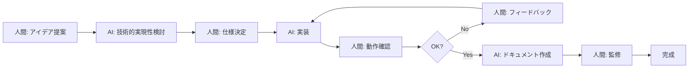

# 🤝 プロジェクト参加者

<div align="center">

**KakeiBonByRust - AI協働開発プロジェクト**

本プロジェクトは、人間とAIの協働により開発されています。

</div>

---

## 👥 参加者と役割

### 🎯 プロジェクトオーナー

**Yoshihiro NAKAHARA**

- 📋 プロジェクト発案者
- 🏗️ プロジェクト設計 / プランニング
- 🎨 システム設計
- 🧪 動作テスト（メイン担当）
- 📝 ドキュメント監修・調整
- 📧 連絡先: bonojovi@zundou.org

### 🤖 AI開発パートナー

**AI Assistant (GitHub Copilot)**

- 💻 コーディング（100% Pure AI）
- 🧪 動作テスト（サブ / 技術サポート）
- 📚 ドキュメント作成（メイン担当）
- 💡 技術アドバイザー / サポート

---

## 🔄 開発体制の特徴

### 人間とAIの役割分担

本プロジェクトは、人間の**創造性・判断力**とAIの**実装力・効率性**を組み合わせた、新しい開発スタイルを採用しています。

#### 🧑 人間（Yoshihiro）の役割

```
┌─────────────────────────────────┐
│ 創造・判断・方向性の決定         │
├─────────────────────────────────┤
│ ✓ アイデアの発案                │
│ ✓ 機能要件の定義                │
│ ✓ UI/UXの方向性決定             │
│ ✓ 実装優先度の判断              │
│ ✓ 最終品質の検証                │
│ ✓ ユーザー視点での評価          │
└─────────────────────────────────┘
```

#### 🤖 AI（Assistant）の役割

```
┌─────────────────────────────────┐
│ 実装・文書化・技術サポート       │
├─────────────────────────────────┤
│ ✓ コード実装（Rust/JS/HTML/CSS）│
│ ✓ テストコード作成              │
│ ✓ 技術的な提案・アドバイス      │
│ ✓ ドキュメント執筆              │
│ ✓ デバッグ・最適化              │
│ ✓ ベストプラクティスの適用      │
└─────────────────────────────────┘
```

---

## 🎨 開発プロセスの例

### 典型的な機能実装の流れ



### 具体例：入出金管理機能

1. **人間**: 「入出金登録機能を実装したい。ヘッダー・明細の2テーブル構造で」
2. **AI**: スキーマ設計案を提示、メリット・デメリットを説明
3. **人間**: 設計を確認・修正、「税率は明細テーブルに持たせよう」
4. **AI**: Rust/SQLコードを実装、テストも作成
5. **人間**: 実アプリで動作確認「口座名が表示されてない」
6. **AI**: JOINクエリ修正、再実装
7. **人間**: 再確認「完璧！」
8. **AI**: ドキュメント作成
9. **人間**: 内容確認・微調整
10. **完成**: コミット＆プッシュ

---

## 💡 この開発体制の利点

### ✅ 高速な開発サイクル
- AIによる迅速なコード実装
- 人間による的確な方向修正
- 短時間での試行錯誤が可能

### ✅ 高品質なコード
- AIがベストプラクティスを適用
- 人間が実用性を検証
- 一貫性のあるコーディングスタイル

### ✅ 充実したドキュメント
- AIが詳細なドキュメントを作成
- 人間が正確性を監修
- 技術的な説明と実用的な情報のバランス

### ✅ 学習と成長
- 人間がAIから技術を学ぶ
- AIが人間のフィードバックから学ぶ
- 相互補完的な関係

---

## 📊 貢献度の内訳

| 領域 | 人間 | AI | 備考 |
|------|------|-----|------|
| **企画・設計** | 80% | 20% | 方向性は人間主導 |
| **コーディング** | 0% | 100% | AIが完全担当 |
| **テスト（実行）** | 90% | 10% | 人間が主に実施 |
| **テスト（作成）** | 10% | 90% | AIがコード作成 |
| **ドキュメント** | 30% | 70% | AI執筆、人間監修 |
| **デバッグ** | 40% | 60% | 協働作業 |

*比率は目安です

---

## 🌟 AI開発の透明性

### なぜAI開発を公表するのか

本プロジェクトでは、AIによる開発を明示的に公表しています。

#### 理由

1. **透明性の確保**
   - ユーザーに対する誠実さ
   - オープンソースの精神

2. **AI開発の可能性を示す**
   - AIと人間の協働モデルの実証
   - 次世代の開発手法の提示

3. **技術的な信頼性**
   - 人間による最終確認を明示
   - 品質保証プロセスの透明化

4. **未来への貢献**
   - AI協働開発の事例として
   - 他のプロジェクトへの参考に

---

## 📞 お問い合わせ

### プロジェクトに関するご質問・ご意見

**Yoshihiro NAKAHARA**  
📧 Email: bonojovi@zundou.org

### 不具合報告・機能要望

[GitHubのIssue](https://github.com/BonoJovi/KakeiBonByRust/issues)にてお願いします。

---

## 📜 ライセンスと著作権

### コードとドキュメント

**MIT License**

Copyright (c) 2025 Yoshihiro NAKAHARA

本プロジェクトはMITライセンスの下で公開されています。  
詳細は[LICENSE](../../LICENSE)ファイルをご覧ください。

### AI生成コードの権利について

本プロジェクトのコードの多くはAIによって生成されていますが、  
プロジェクトオーナー（Yoshihiro NAKAHARA）の指示と監督の下で作成され、  
最終的な品質確認を経ているため、著作権はプロジェクトオーナーに帰属します。

---

## 🔗 関連プロジェクト

### 前身プロジェクト

**[KakeiBon (Original)](https://github.com/BonoJovi/KakeiBon)**  
Lazarus/Free Pascalで開発された安定版

- 完全に人間（Yoshihiro NAKAHARA）によって開発
- すぐに使える完成版
- 日本語専用インターフェース

---

<div align="center">

**Last Updated / 最終更新**: 2025-11-08 17:01 JST

**作成者**: AI Assistant  
**監修**: Yoshihiro NAKAHARA (bonojovi@zundou.org)

---

Made with ❤️ by Human 🤝 AI

[⬆ トップに戻る](#-プロジェクト参加者)

</div>
